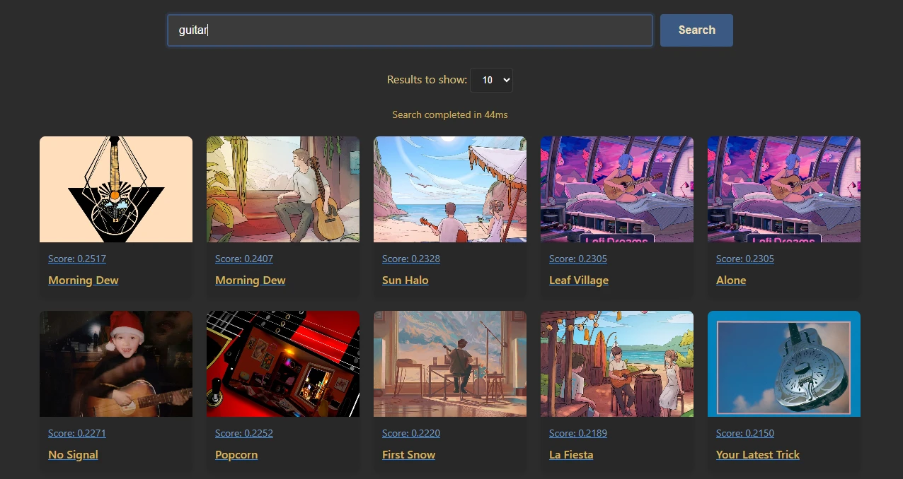

# spotify-img-search

TLDR: I often have an easier time remembering a song's thumbnail than its title, which is annoying
if you are trying to find it. This project downloads all song covers from specified/all your
playlists and uses [CLIP] to expose a search engine as a webserver.

## The "Architecture"

I built this for myself so the structure is unsurprisingly a bit messy. All the spotify interaction
(authentication, downloading song covers) is handled in Rust and exposed via the [`cli`] project.
The rest (AI stuff, webserver) are in Python in [`app.py`].

I used [`uv`]. If you are not on Windows, you probably need to probably need to edit the tool
sources section in [`pyproject.toml`], see [here] for more info.

## Authenticating with Spotify

First, [create a Spotify application] and create a `.env` from [`.env.example`] with your client
ID and secret. Then run any `download` command (from the [`cli`] project), that should open
a Spotify login page in your browser. Log in and copy paste the link you are redirected to in
your terminal. You should only need to do that once.

## Some Numbers

Using CUDA, my RTX 3070 computed embeddings for `11620` song covers in just under `5` minutes. Each
search takes ~`50`ms (except the first one which takes like `200`ms). The images take up `1.3`Gb.

The embeddings are saved locally so they don't have to be recomputed every time. If any changes
happen to the `images` folder (or if a different model is selected or something) then they will
be recomputed but this is very much meant to be a thing you do once and then forget about it
(just like you forgot the song names hehe).

## Other Stuff

- I used DeepSeek to help with the frontend part of the project.
- If you have feature requests I probably won't consider them. This is a very much complete project
  for me and I'm not looking to extend it. Of course you are free and welcome to do whatever you
  want with it :)

[CLIP]: https://huggingface.co/docs/transformers/model_doc/clip
[`cli`]: ./cli
[`app.py`]: ./app.py
[`uv`]: https://docs.astral.sh/uv/
[`pyproject.toml`]: ./pyproject.toml
[here]: https://docs.astral.sh/uv/guides/integration/pytorch/
[create a Spotify application]: https://developer.spotify.com/dashboard/applications
[`.env.example`]: ./.env.example
